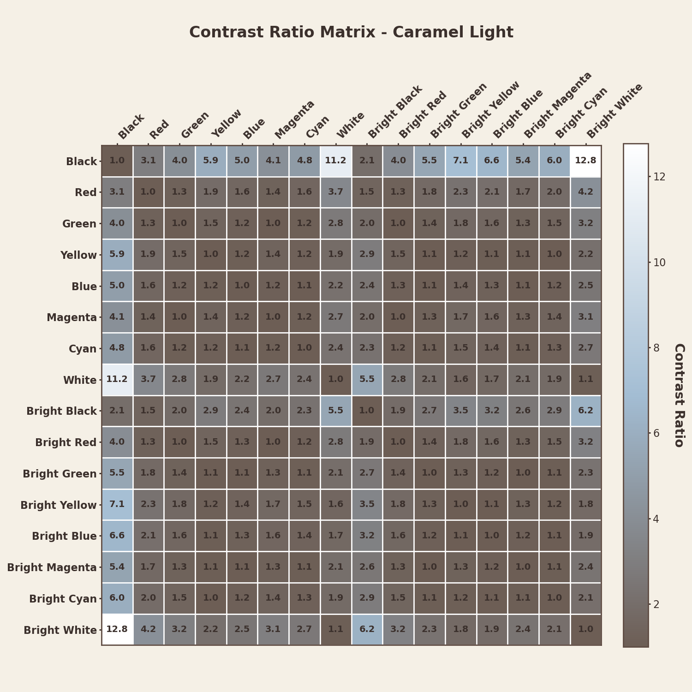

# Caramel Theme Repository

The Caramel repository hosts a meticulously designed color scheme that draws inspiration from warm, earthy tones. It combines soft, muted accents with harmonious contrasts to create a visually appealing and functional palette for diverse applications. The Caramel color scheme is thoughtfully designed to align with WCAG (Web Content Accessibility Guidelines) standards, ensuring optimal readability and usability. By analyzing contrast ratios, the theme prioritizes accessibility, making it suitable for users with visual impairments and environments with varying lighting conditions. The theme includes both light and dark variants, making it ideal for various applications that demand readability, aesthetics, and accessibility.

## Palette
- **Caramel Light Palette**:
  - 
- **Caramel Dark Palette**:
  - 
### Folder Descriptions

- **`color_codes/`**: Contains CSV files detailing contrast ratios for both light and dark themes across various WCAG thresholds.
- **`palette/`**: Includes visual representations of contrast ratios, theme palettes, and plots showcasing color pair relationships.
- **`src/`**: Contains Python scripts for generating images and analyzing color palettes.

## Key Features

### 1. **Color Contrast Analysis**
The repository provides a detailed analysis of color contrast ratios based on WCAG standards:
- **>= 3.1:1**: Suitable for large text and non-text elements.
- **> 4.5:1**: Minimum contrast for normal text.
- **> 7:1**: Ideal for enhanced accessibility and readability.

CSV files in the `color_codes/` folder store these pairwise contrast ratios.

### 2. **Visual Representations**
The `palette/` folder hosts:
- **Contrast Matrices**: Comprehensive contrast ratio matrices for light and dark themes. These matrices display the pairwise contrast ratios of all colors in the palette, adhering to WCAG standards for accessibility.
  

    
  

  

    
  

- **Contrast Pair Plots**: Bar plots visualizing contrast pairs exceeding specified thresholds. These plots serve as a valuable guide for designers to select color pairs that meet accessibility standards while ensuring aesthetic harmony. By visualizing contrast ratios for different thresholds, these plots help identify suitable color combinations for text, backgrounds, and UI elements, enhancing readability and user experience.

  
<b>Threshold 3.1:1</b>: Suitable for large text and non-text elements, ensuring minimal contrast for visual distinction.

  

    
  

  

    
  

  
  
<b>Threshold 4.5:1</b>: The minimum contrast ratio recommended for normal text readability.

  

    
  

  

    
  

  
  
<b>Threshold 7:1</b>: Ideal for enhanced readability and maximum accessibility.

  

    
  

  

    
  

  

## License
This project is licensed under the MIT License. See the `LICENSE` file for details.

## Contributing
At this time, I am not accepting contributions. However, feel free to fork the repository and customize it for your own use.

## Contact
For questions or feedback, reach out to the project maintainers via the GitHub repository.

